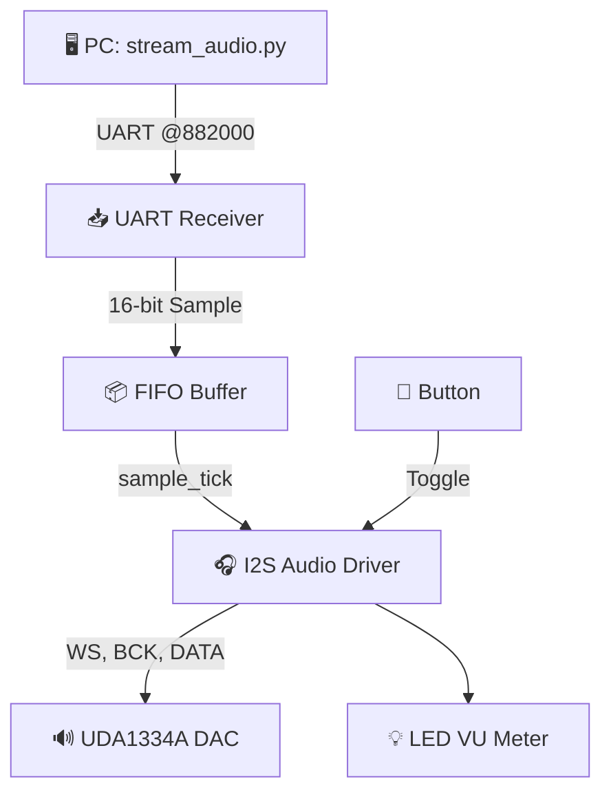

<h1 align="center">🎶 FPGA-AudioStream 🎶<br> <sub>Real-Time 16-bit Audio over UART to I2S DAC</sub></h1>

<p align="center">
  
  
  
  
</p>

---

## 📘 Overview

**FPGA-AudioStream** is a lightweight Verilog-based system that allows you to stream 16-bit mono WAV audio files from your PC directly to a DAC using the I2S protocol. It transmits the audio using UART (882000 baud) and decodes it in real-time on a resource-constrained FPGA (e.g., Tang Nano 9K).

🔧 Designed for bare-metal FPGA hardware with:
- Smooth FIFO buffering,
- Mute toggling via button,
- LED VU meter visualization,
- Real-time I2S DAC output (e.g., UDA1334A).

---

## 🔩 Features

✨ UART streaming of 16-bit PCM WAV  
📦 FIFO buffer for rate decoupling  
🎚️ Real-time I2S DAC output  
🎛️ Button-based mute toggle  
💡 LED-based audio intensity visualization  
🧱 Pure RTL (no CPU, no OS)

---

## 🔧 Hardware Setup

### 🧠 FPGA Platform
- 🟢 Gowin Tang Nano 9K (or equivalent)
- 🟣 UDA1334A I2S DAC
- 🧵 UART interface (FTDI, CH340, CP2102, etc.)

### 🔊 Audio Output
- Passive/active speakers or headphone amp connected to DAC

---

## 📦 Repository Structure

```
📁 fpga-audiostream/
├── uart.v          # UART Receiver (16-bit samples + LED logic)
├── FIFO.v          # FIFO buffer between UART and I2S
├── driver.v        # I2S generator (BCK, WS, DATA) + mute logic
├── stream_audio.py # Python tool to stream WAV over UART
└── README.md       # This file
```

---

## 🧠 System Diagram



---

## 🚀 Getting Started

### 1️⃣ Flash the Bitstream
Synthesize `uart.v`, `FIFO.v`, and `driver.v` into a bitstream and upload it to your FPGA.

### 2️⃣ Connect Your UART
Identify your UART port (e.g., `/dev/ttyUSB1`) connected to the FPGA.

### 3️⃣ Stream the Audio

```bash
pip install pyserial
python3 stream_audio.py music.wav --port /dev/ttyUSB1
```

Loop playback:

```bash
python3 stream_audio.py music.wav --port /dev/ttyUSB1 --loop
```

> 📌 **WAV File Requirements:**  
> - Format: 16-bit PCM  
> - Sample Rate: 44100 Hz  
> - Channels: Mono(Can be made into duual channel, you have to find a more stable comm protocol for that)

---

## 🛠️ Technical Highlights

### 🎚️ Volume Scaling (Python Side)

Fixed-point scaling applied before transmission:
```python
scaled_sample = (sample * scale + 128) >> 8
```

### ⏱️ Timing Configuration
- FPGA Clock: 27 MHz  
- UART Baud Rate: 882000  
- `DELAY_FRAMES`: ~31 for sampling ~44.1 kHz

### 🔄 Mute Logic
- Rising edge of button toggles mute
- During mute, DAC receives 0s

### 🔢 I2S Format
- 16-bit Stereo output (duplicated mono)
- BCK from PLL @ 1.4994 MHz
- WS toggles every 17 BCKs

---

## 📊 Performance Metrics

| Parameter        | Value              |
|------------------|--------------------|
| Audio Format     | 16-bit PCM WAV     |
| Channels         | Mono (duplicated)  |
| Sample Rate      | 44.1 kHz           |
| UART Baud Rate   | 882000             |
| FIFO Depth       | 256 samples        |
| Output Protocol  | I2S (DAC compatible) |
| DAC Used         | UDA1334A           |

---

## 🙋‍♂️ FAQ

**Q: Can I stream stereo audio?**  
A: Not currently. Mono data is duplicated to both I2S channels.

**Q: What happens if FIFO overflows?**  
A: Data loss may occur. Ensure UART bitrate matches I2S sampling.

**Q: How does LED intensity work?**  
A: Accumulated absolute sample values over time determine LED brightness.

---

## 📄 License

MIT License © 2025

---

## 🙌 Acknowledgements

- Inspired by FPGA audio and UART tutorials
- I2S output modeled after UDA1334A datasheet
- Python scaling logic adapted for embedded audio

---

🎧 Enjoy FPGA-powered audio with **FPGA-AudioStream**! Let me know if you want to add stereo support, OGG/WAV compression, or SD card integration.
